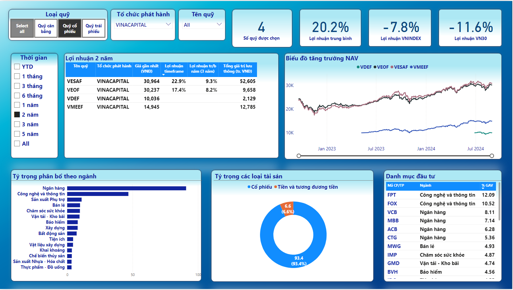
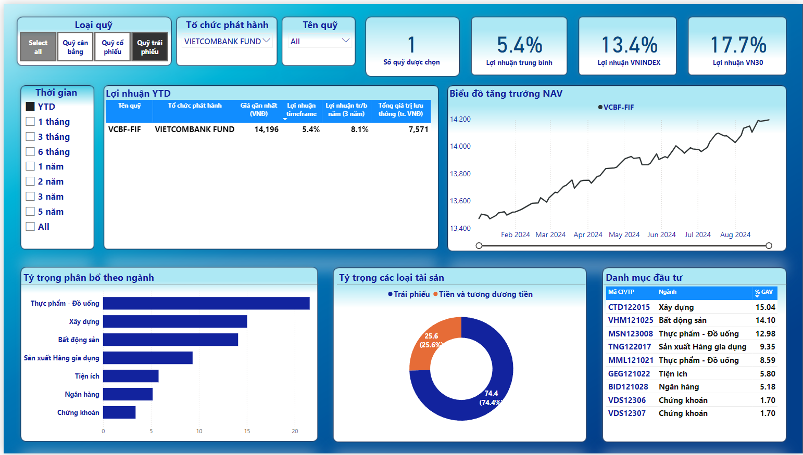

# Personal Project: Fund Analytics

## 1. Objective

- To use historical data and industry categories of all funds, compare them, and select the best fund to invest in.

## 2. Approach

- **Data Collection:** Crawl data from all funds on Fmarket using the public API.
- **Data Processing:** Store the processed data in SQL Server.
- **Visualization:** Import the data into Power BI to create dashboards for fund comparison.
- **Decision-Making:** Analyze the dashboards to make informed investment decisions.

## 3. Result

After about few days of researching and practicing Power BI from scratch, here's my first dashboard:

From the dashboard, we can choose to view data by different Fund Groups, Issuing Organizations, or drill down to specific fund codes.
This allows us to compare fund performance by looking at how different funds stack up against each other and directly against the VNINDEX and VN30 benchmarks over customizable time periods.

Additionally, the dashboard provides a clear view of the fund's asset allocation across different asset types and investment sectors, giving us insights into the specific stocks or bonds held within each fund. This helps in understanding where the investments are concentrated and identifying the major contributors to the fund’s performance.

